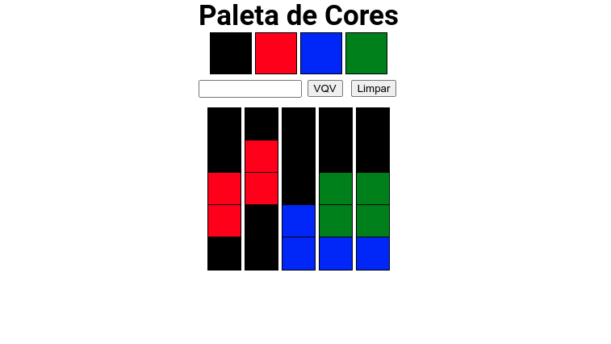

<!-- Introdução -->
<h1 align="center"> Projeto Pixels Art  - :three: </h1>

<!-- Descrição -->
<p align="center">
Este é meu terceiro projeto desenvolvido em minha jornada de aprendizado como desenvolvedor na Trybe,
nele desenvolvi uma página dinâmica que permite a construção de pixel arts num quadro.
</p>

#
<!-- Habilidades -->
<h2 align="center"> Habilidades Desenvolvidas: </h2>

* Utilizei _JavaScript_ para tratar eventos e gerir o DOM dando dinâmicidade à página. :heavy_check_mark:
* Utilizei _HTML_ semântico para estruturar minha página de forma acessível e melhor ranqueada. :heavy_check_mark:
* Utilizei _CSS_ para posicionar elementos e adicionar um estilo que é alterado dinâmicamente . :heavy_check_mark:

#
<!-- Preview -->
<h2 align="center"> Preview: </h2>

<div align="center">
    
</div>

#
<!-- Ferramentas utilizadas -->
<details align="center">
  <summary>
	  <h2>Ferramentas e Tecnologias utilizadas:</h2>
	</summary>

  <div align="center">

  | Linguagens              | Tecnologias             |
  | :---------------------- | :---------------------- |
  | JavaScript              | HTML                    |
  | .                       | CSS                     |

  </div>

</details>

#
<!-- Instalação e utilização -->
<details align="center">
  <summary>
    <h2>Como instalar e utilizar o projeto:</h2>
  </summary>

<details>
  <summary>
    <h3>Especificações Tecnicas:</h3>
  </summary>

  <div align="left">
  
  * Git - <i> `git -v` informará a versão em uso.</i>

  </div>

  #

  </details>

  <div align="left">
    
  1. Faça a clonagem do projeto - <i>Nenhuma depêndencia externa é utilizada.</i>
  ```shell
  git clone git@github.com:luanfgoncalves/project-pixels-art.git
  ```
  2. Abra o arquivo `index.html` na raíz do projeto - <i>A página depende dos outros arquivos no mesmo diretório.</i>
  
  </div>

</details>

#
<!-- Meu contato -->
<h2 align="center"> Se conecte comigo: </h2>

<div align="center">
  <a href="https://instagram.com/luanfgoncalves" target="_blank"></a>
  <a href = "mailto:luanfgoncalves@outlook.com"></a>
  <a href="https://www.linkedin.com/in/luanfgoncalves/" target="_blank"></a> 
</div>
